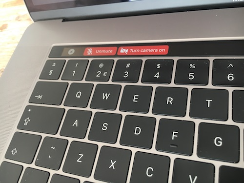
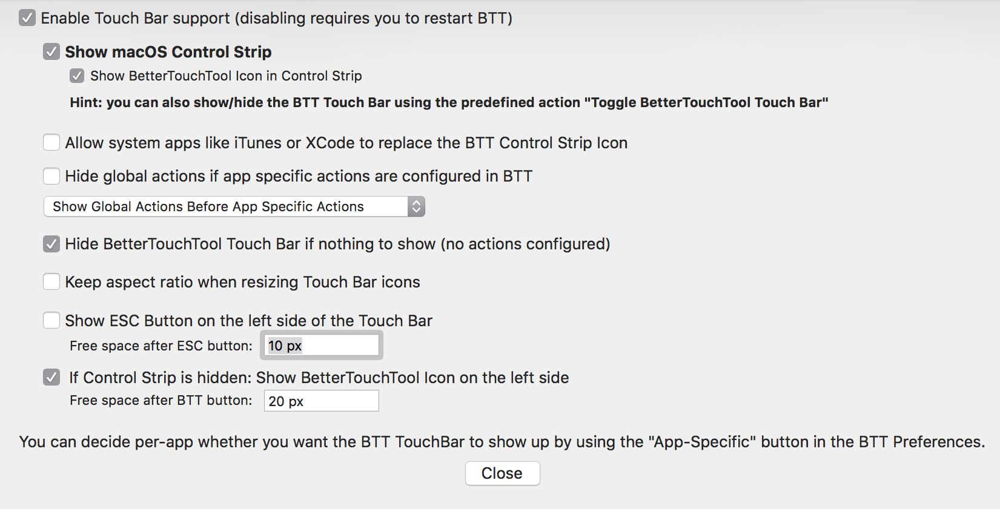

## Control Google Hangouts calls from your Touch Bar

Always losing the tab with your Google Hangouts call and you need to be able to quickly turn off the camera or microphone then this is for you!

When a Google Hangouts call is active in Google Chrome you will have the following buttons in the Touch Bar.

This allows you to quickly mute your microphone.

And turn your video camera off.

### Installation

* Use Google Chrome.
* Install [BetterTouchTool](https://www.boastr.net/).
* [Import](http://boastr.net/docs/docs/preferences_presets.html) the JSON file [TouchBarHangouts.json](TouchBarHangouts.json) into BetterTouchTool.
* Configure BetterTouchTool "General Touch Bar Settings" to your needs. I use the following settings:

Now you can use the buttons whenever a Google Hangouts call is active.

#### Links

<a href="https://icons8.com">Icon pack by Icons8</a>

**Note**:
I can not guarantee that this code will work in all languages and continue to work in the future since the HTML markup of Hangouts might change without notice.
